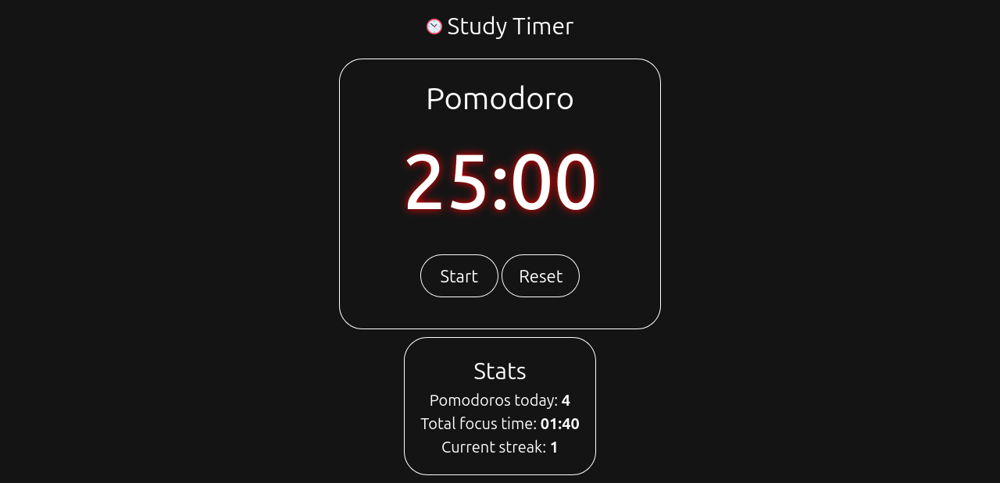

# 🕒 Study Timer

A simple, front-end-only [Pomodoro](https://en.wikipedia.org/wiki/Pomodoro_Technique) timer built with vanilla HTML, CSS, and JavaScript.
It supports regular Pomodoro sessions, short breaks, and long breaks, following the 25/5/15 rule.

## Features

- Pomodoro / Break / Long Break modes
- Automatic mode switching (every 4 pomodoros → long break)
- Persistent session stats with localStorage
- Daily streak tracking
- Browser notifications when time is up

## Usage

1. Clone or download this repo.
2. Open `index.html` in any modern browser.
3. Click **Start** to begin your Pomodoro session.

## Stats Tracked
- [x] Pomodoros completed today
- [x] Total focus minutes
- [x] Daily streak
- [ ] 7-day activity chart

## License

MIT — use freely, contribute optionally.